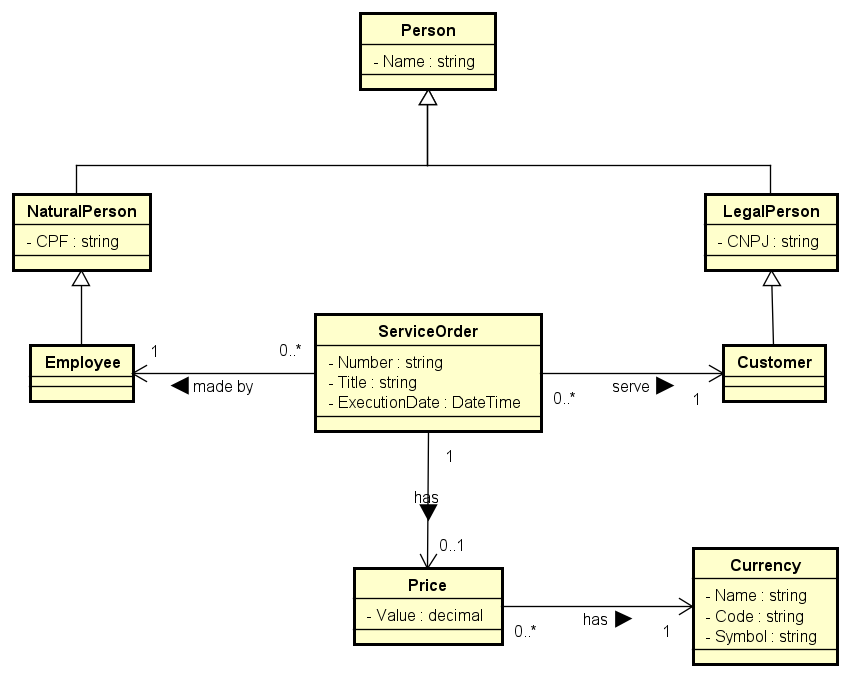

# ProsperiDevLab
Desafio para ingressão na vaga de Back-end Developer .NET da Prosperi.

## 🛠️ Tecnologias utilizadas
- <span>ASP.NET</span> Core 3.1 Web API
- Entity Framework Core 5.0.6
- MS SQL Server 13.0.40001 (LocalDB)
- Node.js 14.17.0
- Angular 12.0.3

## 🚀 Execução da aplicação local
### .NET Core API
Defina a variável de ambiente `ConnectionStrings__DefaultConnection` para configuração do banco de dados. Esta, por padrão, encontra-se configurada para utilizar o LocalDB do MS SQL Server em ambiente de desenvolvimento. Em seguida, navegue até o diretório `ProsperiDevLab/` e execute um dos comandos abaixo para criar o banco e suas tabelas:
```bash
#Package-Manager
Update-Database

#Dotnet CLI
dotnet ef database update
```
Para restaurar as dependências do projeto .NET e executar a API, utilize os comandos que se seguem ou use o ferramental do Visual Studio:
```bash
dotnet restore
dotnet run
```
Caso execute a aplicação em modo self-host, ela ficará disponível em [http://localhost:5000/api](http://localhost:5000/api) ou [https://localhost:5001/api](https://localhost:5001/api), mas caso utilize o IIS, acesse por [https://localhost:44390/api](https://localhost:44390/api). A documentação da API pode ser consultada em
`<HOST>/swagger/index.html`.

### Angular UI
Para restaurar as dependências e executar a aplicação Angular, navegue até o diretório `ProsperiDevLab/ClientApp/` e defina a variável `API_URL` em `src/environments/environment.ts` com o host utilizado na API. Em sequência, utilize os comandos abaixo:
```bash
npm install
npm start
```

A aplicação Angular encontra-se disponível em [http://localhost:4200/](http://localhost:4200/)

## 📰 Documentação
### Definição de requisitos (funcionais)
A XPTO Orçamentos Ltda. é uma empresa especializada em prestação de serviços para diversas áreas do mercado. A empresa XPTO possui uma equipe altamente especializada para execução dos diversos serviços que oferece a todas as empresas as quais possui contrato. Para cada serviço prestado pela empresa XPTO, uma Ordem de Serviço (OS) é emitida manualmente e encaminhada ao endereço da empresa contratante.

O sistema deverá ter, em sua tela principal, a listagem de todas as OSs (Ordens de Serviços) cadastradas no sistema, além de um botão para criação de uma nova OS. Para cada item da listagem, deve haver um botão para edição e outro para exclusão. Ao editar um item da listagem, deverá ser aberta a tela de cadastro com as informações já preenchidas da OS.

A listagem deverá conter os seguintes campos:
- Nº da OS
- Título do Serviço
- Nome do Cliente
- Valor do Serviço
- Data de Execução

A tela de cadastro deverá conter os seguintes campos:
- Nº da OS
- Título do Serviço
- CNPJ do Cliente
- Nome do Cliente
- CPF do Prestador de Serviço
- Nome do Prestador de Serviço
- Data de Execução do Serviço
- Valor do Serviço


### Diagrama de classes
